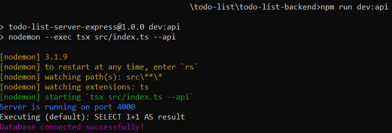
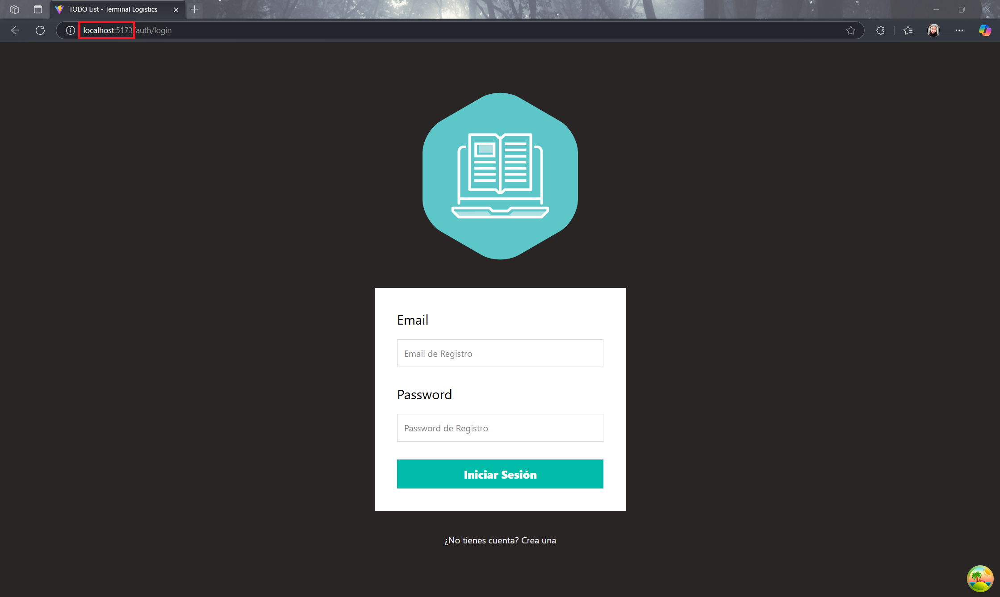

# TODO List

TODO List es una aplicación web diseñada para ayudar a los usuarios a organizar y llevar un seguimiento eficiente de sus tareas diarias. Con una interfaz intuitiva y personalizable, permite la creación y gestión de listas de tareas de manera sencilla, facilitando la planificación y ejecución de actividades personales o profesionales.

La aplicación ofrece funcionalidades como la consulta, creación, modificación y eliminación de tareas mediante formularios y mediante un inicio de sesión.

## Instalación y ejecución

1. Descarga el proyecto en formato ZIP
2. Abre una terminal de windows y dirígete a la carpeta en donde se encuentra el backend del proyecto.
3. Instala todas las dependencias de node mediante el comando:

```bash
  npm install
```

4. Ejecuta el servidor local usando el comando:

```bash
  npm run dev:api
```

5. Dirígete a la carpeta en donde se encuentra el frontend del proyecto.
6. Instala todas las dependencias de node mediante el comando:

```bash
  npm install
```

7. Ejecuta el servidor local usando el comando:

```bash
  npm run dev
```

8. Ingresa al enlace del servidor local en el navegador de tu preferencia como se muestra a continuación:






## Funcionalidades

-   **Creación de cuenta**: Al ejecutar la aplicación, se solicitarán las credenciales para el inicio de sesión, es por ello que en caso de no tener una cuenta, es necesario ir al apartado correspondiente para crearla.
-   **Inicio de Sesión**: Si el usuario ya tiene una cuenta, basta con introducir las credenciales correspondientes en la interfaz para el inicio de sesión.
-   **Creación de tareas**: Para crear una tarea, hay que seleccionar el botón "Crear tarea" ubicado en la parte superior izquierda de la interfaz, esto redirigirá al usuario a un formulario que le permitirá darla de alta.
-   **Visualización de tareas**: En la página de inicio se encontrarán desplegadas las tareas por hacer, así como las que ya fueron realizadas, en la parte superior e inferior, respectivamente.
-   **Actualización de tareas**: Para editar una tarea, solo hace falta seleccionar su tarjeta, esto redirigirá al usuario a un formulario que le permitirá realizar los cambios que desee.
-   **Eliminación de tareas**: La eliminación de tareas también es muy sencilla, solo hace falta seleccionar la tarjeta de la tarea que desea eliminar, esto redirigirá al usuario a la interfaz de actualización, para eliminarla, hay que seleccionar el botón rojo "Eliminar tarea", ubicado en la parte superior derecha.
-   **Cierre de sesión**: Para cerrar sesión únicamente hace falta seleccionar el botón "Cerrar sesión", ubicado en la parte superior derecha de la interfaz.

## Referencias de APIs

#### Crear cuenta

```http
  POST /auth/register
```

| Request | Type   | Description                                                                                            |
| :------ | :----- | :----------------------------------------------------------------------------------------------------- |
| `body`  | `JSON` | **Required**: "name" (String), "email" (String), "password" (String), "password_confirmation" (String) |

#### Inicio de Sesión

```http
  POST /auth/login
```

| Request | Type   | Description                                         |
| :------ | :----- | :-------------------------------------------------- |
| `body`  | `JSON` | **Required**: "email" (String), "password" (String) |

#### Crear tarea

```http
  POST /tasks
```

| Request         | Type           | Description                                           |
| :-------------- | :------------- | :---------------------------------------------------- |
| `body`          | `JSON`         | **Required**: "name" (String), "completed": (Boolean) |
| `Authorization` | `Bearer Token` | **Required**: JWT                                     |

#### Obtener todas las tareas

```http
  GET /tasks
```

| Request         | Type           | Description                                           |
| :-------------- | :------------- | :---------------------------------------------------- |
| `body`          | `JSON`         | **Required**: "name" (String), "completed": (Boolean) |
| `Authorization` | `Bearer Token` | **Required**: JWT                                     |

#### Obtener una tarea

```http
  GET /tasks/${id}
```

| Request         | Type           | Description       |
| :-------------- | :------------- | :---------------- |
| `Authorization` | `Bearer Token` | **Required**: JWT |

#### Editar tarea

```http
  PUT /tasks/${id}
```

| Parameter | Request         | Type           | Description                           |
| :-------- | :-------------- | :------------- | :------------------------------------ |
|           | `Authorization` | `Bearer Token` | **Required**: JWT                     |
| `id`      |                 | `Int`          | **Required**: ID de la tarea a editar |

#### Eliminar tarea

```http
  DELETE /tasks/${id}
```

| Parameter | Request         | Type           | Description                             |
| :-------- | :-------------- | :------------- | :-------------------------------------- |
|           | `Authorization` | `Bearer Token` | **Required**: JWT                       |
| `id`      |                 | `Int`          | **Required**: ID de la tarea a eliminar |

## Arquitectura y diseño

### Arquitectura

Para desarrollar este proyecto se optó por utilizar la arquitectura MVC (Model View Controller), debido a que permite un mejor orden en el desarrollo y una mayor escalabilidad.

Igualmente, se utilizó Router, como herramienta de navegación

### Diseño

Para mejorar la presentación de las interfaces, se optó por utilizar el framework CSS tailwindcss, debido a su facilidad de uso y sus excelentes recursos visuales.

## Tecnologías utilizadas

**Frontend:** React, TypeScript, TailwindCSS.

**Backend:** PostreSQL, NodeJS, Express, TypeScript.
